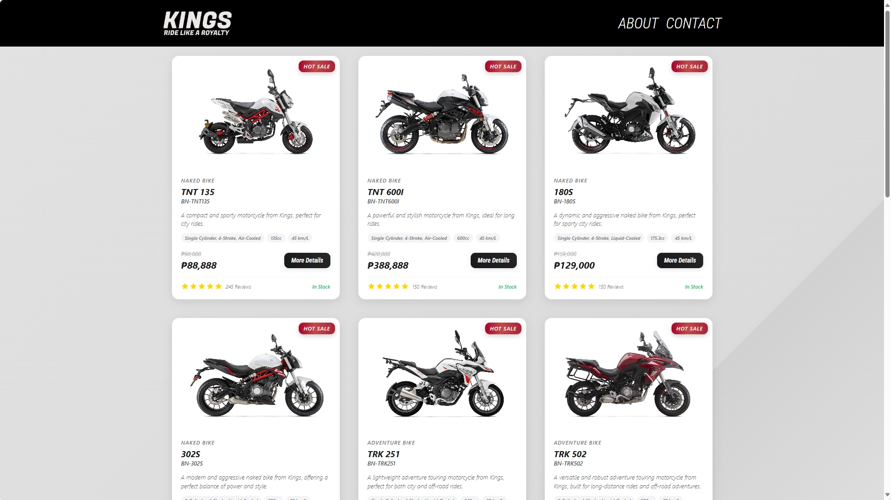
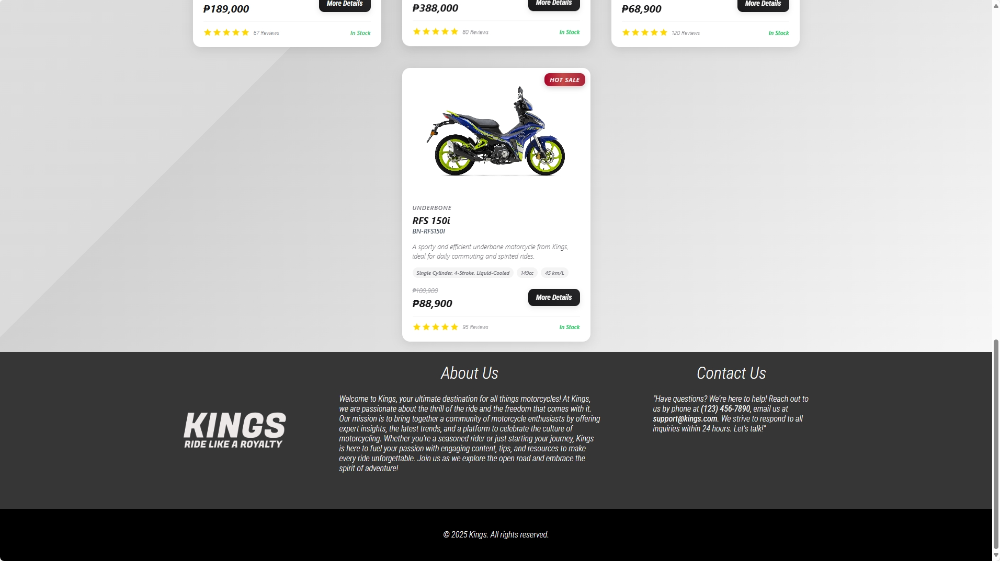
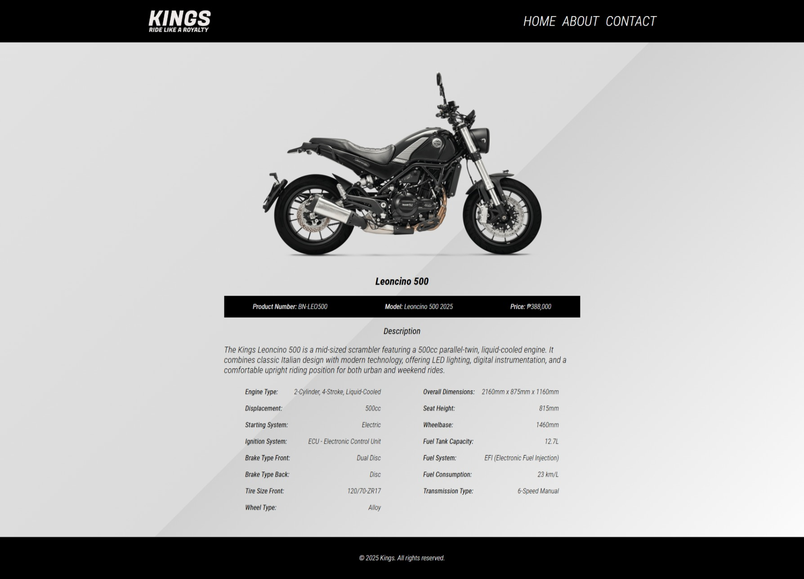
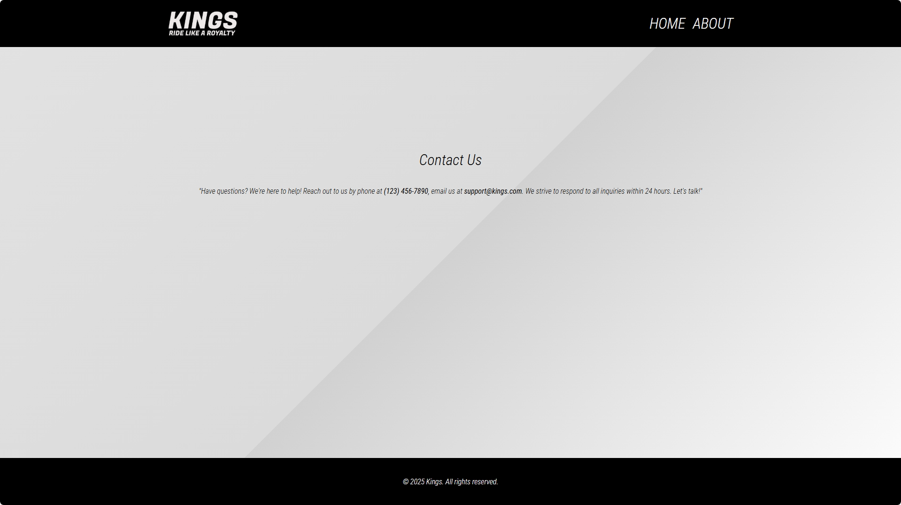
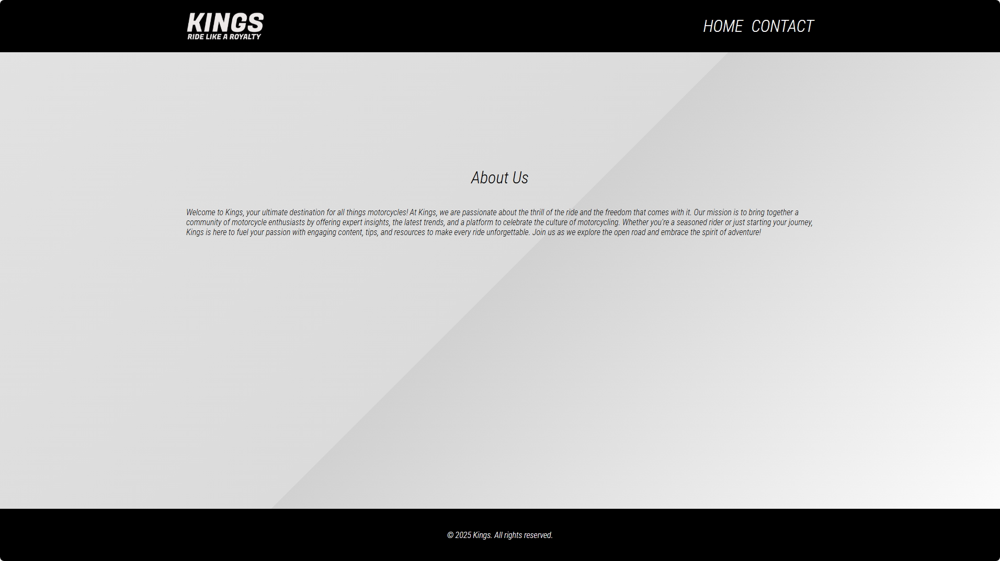

# 🏍️ Motorcycle-Catalog

A responsive and visually appealing web application that showcases a curated catalog of motorcycles. Built using **HTML**, **CSS**, and **JavaScript**, this project highlights clean design, interactive features, and a user-friendly interface.

---

## 📋 Features
- Responsive layout for various screen sizes
- Interactive and dynamic content rendering
- Clean and modern user interface
- Image-based catalog entries

---

## 🛠️ Technologies Used
- HTML5
- CSS3
- JavaScript (ES6)

---

## 📸 Screenshots
Below are sample screenshots of the website located in the `motorcycle-images/` directory:







---

## 🚀 How to Run
1. Clone the repository:
   ```bash
   git clone https://github.com/yourusername/Motorcycle-Catalog.git
   ```
2. Navigate to the project directory:
   ```bash
   cd Motorcycle-Catalog
   ```
3. Open `index.html` in your browser to view the catalog.

---

## 📄 License
This project is licensed under the MIT License. See the [LICENSE](LICENSE) file for details.
